# Week 3 — Python Data Processing Lab

**Student:** Irembere Olivier 28392

**Course:** Intro to Big Data

**Group:** A

**Lab:** Week 3 — Python Data Processing

**Notebook:** `Week3_Irembere.ipynb`

**Dataset:** `week3_students.csv`

---

## Overview

This lab focused on Python programming and basic data processing using a student dataset containing **40 student records**.

The main topics covered were:

* Conditional statements
* Combined conditions
* `for` loops
* `while` loops
* Accumulator patterns
* Functions
* Reading CSV files
* Exception handling
* Data validation
* Dictionary accumulators
* Writing and reading text files

The dataset contains **3 records with broken/non-numeric scores**, which were handled using `try` and `except`.

---

## Part 1 — Making Decisions

### Exercise 1.1 — Grading Ladder

An `if/elif/else` ladder was used to assign letter grades:

| Score        | Grade |
| ------------ | ----- |
| 85 and above | A     |
| 70–84        | B     |
| 60–69        | C     |
| 50–59        | D     |
| Below 50     | F     |

Test results:

```text
91 → A
76 → B
64 → C
52 → D
43 → F
```

### Exercise 1.2 — Combined Conditions

The AUCA validation rule was implemented using combined conditions:

* Score ≥ 50 and attendance ≥ 75 → `Validated`
* Score ≥ 50 but attendance < 75 → `Blocked: low attendance`
* Score < 50 → `Failed`

Test results:

```text
(76, 92) → Validated
(76, 68) → Blocked: low attendance
(43, 95) → Failed
```

### Exercise 1.3 — Reflection

If `elif score >= 50` came before `elif score >= 70`, scores of 70 or higher would satisfy the 50-or-higher condition first and would never reach the 70-or-higher condition.

---

## Part 2 — Loops & the Accumulator

The following list was used:

```python
scores = [72, 85, 91, 64, 78, 47, 88, 55, 93, 61]
```

### Exercise 2.1 — Loop + Filter

A `for` loop was used to print only scores greater than or equal to 80.

```text
Top score: 85
Top score: 91
Top score: 88
Top score: 93
```

### Exercise 2.2 — Accumulator

Using one loop without `sum()`, `len()`, or `max()`, the following results were calculated:

| Result  | Value |
| ------- | ----: |
| Total   |   734 |
| Count   |    10 |
| Average |  73.4 |
| Passed  |     9 |
| Failed  |     1 |

The accumulator pattern used was:

**Initialize → Loop → Update → Report**

### Exercise 2.3 — While Loop

A `while` loop was used to calculate how many months were required to save enough money for a laptop costing 250,000 RWF.

* Monthly saving: **15,000 RWF**
* Laptop cost: **250,000 RWF**
* Months required: **17**
* Total saved: **255,000 RWF**

---

## Part 3 — Functions

### Exercise 3.1 — `get_grade()`

The grading ladder was converted into a reusable `get_grade(score)` function.

Test results:

```text
91 → A
76 → B
43 → F
```

The function also includes a one-line docstring.

### Exercise 3.2 — `pass_rate()`

A `pass_rate(score_list)` function was created using an accumulator.

For the Part 2 scores:

```text
Passed: 9
Total: 10
Pass rate: 90.0%
```

---

## Part 4 — Reading the CSV File

The `week3_students.csv` file was opened using Python's `open()` function and read using `readlines()`.

The dataset contains:

* **1 header line**
* **40 student records**
* **41 lines in total**

The header is counted as a line, which is why the file contains 41 lines instead of 40.

The Name column was extracted by:

1. Skipping the header using `lines[1:]`
2. Removing whitespace using `.strip()`
3. Splitting each line using `.split(",")`
4. Selecting the name using index `1`

The resulting list contains **40 student names**.

---

## Part 5 — The Resilient Pipeline

### Exercise 5.1 — Survive the Mess

The dataset contains **3 broken score records**.

The program used `try` and `except ValueError` to safely convert scores into integers.

Valid scores were added to the total and counted, while invalid records were recorded using their student IDs.

### Results

```text
Valid records: 37
Bad records: 3
Bad student IDs: [ADD YOUR 3 IDS HERE]
Average score: [ADD YOUR AVERAGE HERE]
```

The program continued processing the dataset instead of crashing when it encountered invalid scores.

---

### Exercise 5.2 — Grades & Top Student

Among the valid records, the program calculated:

* Passed students
* Failed students
* Highest score
* Student with the highest score
* Letter grade of the top student

The highest score was tracked using:

```python
best_score = -1
best_name = ""
```

### Results

```text
Passed: [ADD RESULT]
Failed: [ADD RESULT]
Best score: [ADD RESULT]
Best student: [ADD RESULT]
Top student's grade: [ADD RESULT]
```

---

### Exercise 5.3 — Report by District

Two dictionary accumulators were used to calculate the total scores and number of students for each district:

```python
sums[d] = sums.get(d, 0) + s
counts[d] = counts.get(d, 0) + 1
```

The dataset contains **8 districts**, with **5 students per district**.

### District Averages

```text
[ADD YOUR DISTRICT AVERAGES HERE]
```

**District with highest average:** `[ADD DISTRICT]`

**Highest average:** `[ADD AVERAGE]`

---

## Bonus — Output File

A report named `week3_report.txt` was created using Python file handling.

The report contains:

* Student count
* Valid records
* Bad records
* Average score
* Top student
* Top score

The file was then read back and printed to verify its contents.

---

# Part 6 — Reflection

### 1. Dataset Trust

I would stop trusting the dataset if more than 10% of the records had broken or invalid scores. Instead of simply skipping those records, I would investigate the original data source, identify why the values are incorrect, and correct or replace the invalid records before continuing the analysis. If the errors could not be reliably corrected, I would report the data-quality problem and avoid making conclusions from the dataset.

### 2. What Surprised Me

One thing that surprised me was that a single invalid score could normally cause the program to stop with a `ValueError`, but using `try` and `except` allowed the program to handle the broken record and continue processing the remaining students.

---

# Screenshots

## Part 1 — Making Decisions

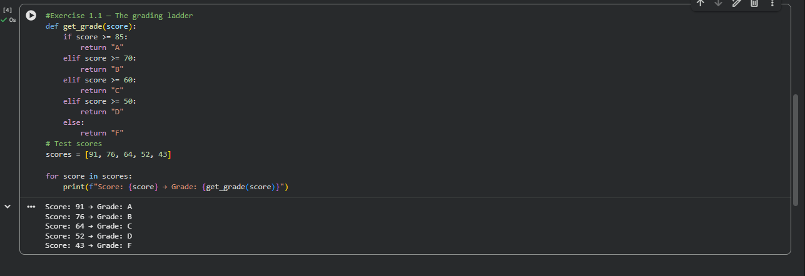

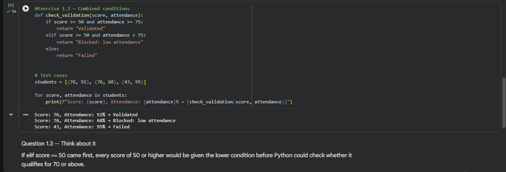

---

## Part 2 — Loops & Accumulator

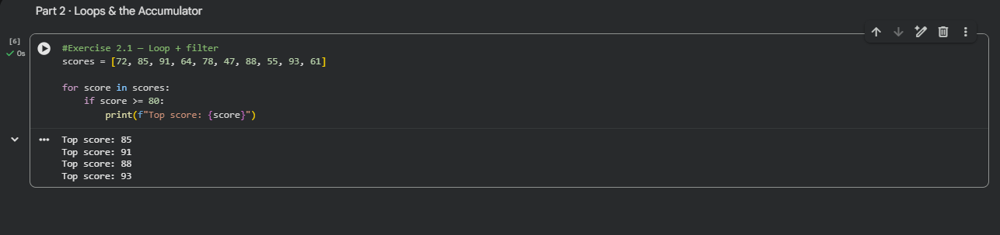

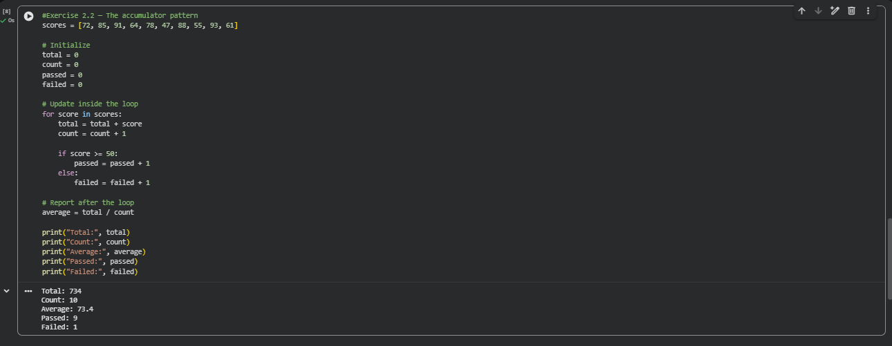

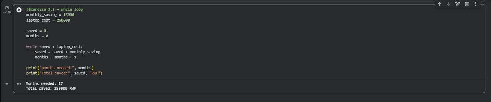

---

## Part 3 — Functions

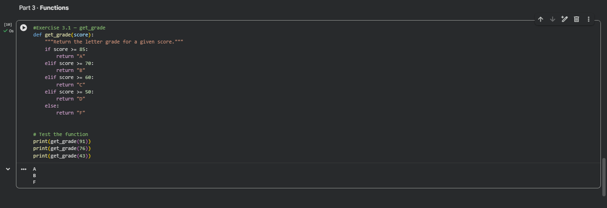

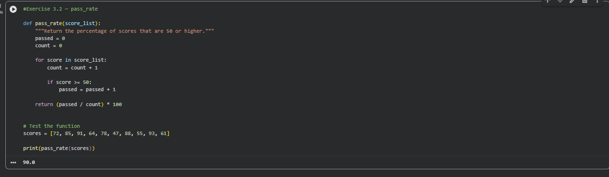

---

## Part 4 — Reading the CSV


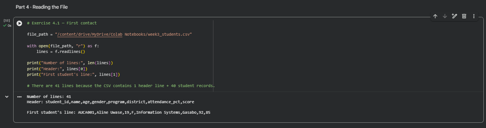

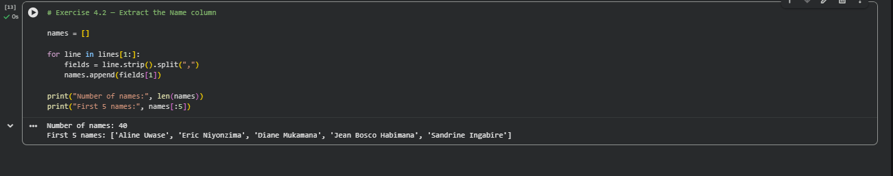

---

## Part 5.1 — Survive the Mess


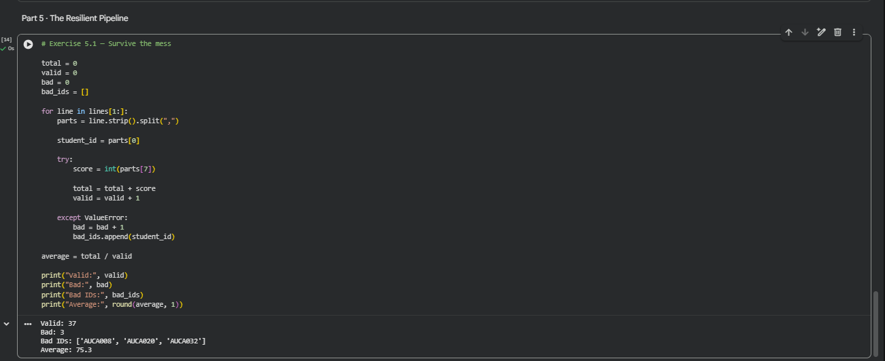

---

## Part 5.2 — Grades & Top Student

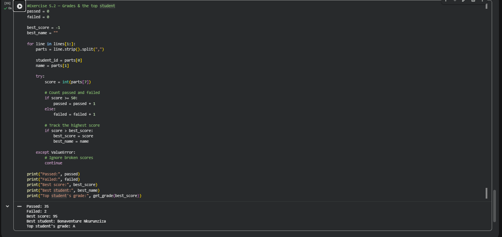

---

## Part 5.3 — Report by District


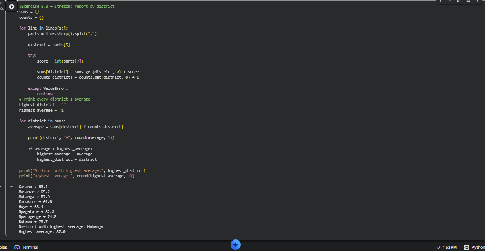

---

## Bonus — Output File


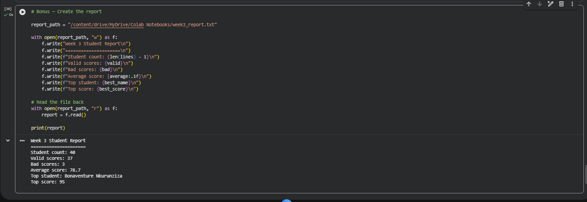

---
## Part 6 — Reflection

### Reflection 1 — Data Quality

The pipeline skipped 3 broken records out of 40, which is 7.5%. I would stop trusting the dataset if more than 10% of the records had broken or invalid scores. Instead of simply skipping those records, I would investigate the original data source, identify why the values are incorrect, and correct or replace the invalid records before continuing the analysis. If the errors could not be reliably corrected, I would report the data-quality problem and avoid making conclusions from the dataset.

### Reflection 2 — What Surprised Me

One thing that surprised me was that a single invalid score could normally cause the program to stop with a `ValueError`. Using `try` and `except` allowed the program to handle the broken record and continue processing the remaining students without stopping the entire pipeline.


---

# Conclusion

This lab provided practical experience with Python control structures, loops, functions, file handling, exception handling, and basic data processing.

The most important concept was building a resilient pipeline that can detect invalid data, handle errors without crashing, and continue processing valid records.
